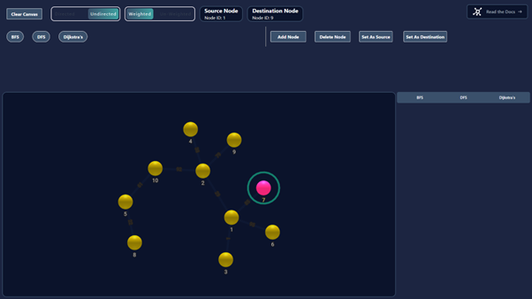
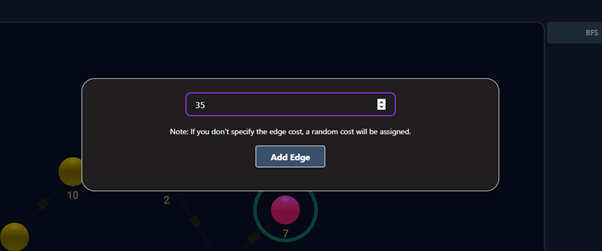

# Graph Visualizer

An interactive web application designed to help students and enthusiasts understand the execution of fundamental graph algorithms such as **Dijkstra**, **Breadth-First Search (BFS)**, and **Depth-First Search (DFS)**. This project uses modern web technologies to create a visually engaging and educational tool, allowing users to visualize the step-by-step execution of these algorithms.

## 🚀 Features

- **Graph Creation**: Add, remove, and manipulate nodes and edges in real-time.
- **Algorithm Simulation**: Visualize the execution of Dijkstra, BFS, and DFS algorithms with animated transitions.
- **Interactive Controls**: Pause, step forward, and rewind through algorithm execution to observe every detail.
- **Customizable Graphs**: Supports both **directed/undirected** and **weighted/unweighted** graphs.
- **Responsive UI**: Ensures an optimal experience across devices, from desktops to smartphones.

## 🎓 Educational Purpose

Understanding graph algorithms can be challenging using traditional methods. This application provides an interactive and visual approach, enabling users to:

- Gain deeper insights into how graph algorithms operate.
- Follow the algorithm's progress, step by step.
- Manipulate the graph to observe different behaviors of algorithms on varying inputs.

## 🛠️ Technologies Used

- **React.js**: The front-end framework used for building the interactive user interface.
- **JavaScript (ES6)**: Core logic for implementing and simulating graph algorithms.
- **D3.js** and **ReaGraph**: Libraries used to visualize and render graphs dynamically.
- **Tailwind CSS**: Provides the design foundation for a responsive and aesthetically pleasing UI.

## 📸 Screenshots

  
_Figure: The initial state of the graph with BFS algorithm selected._

---

  
_Figure: Showing the optimal path found by Dijkstra's algorithm._

---

  
_Figure: Showing the intermediate stages of DFS._

---

  
_Figure: UI when 1 node is selected. You can delete the node or set it as a source or destination._

---

  
_Figure: UI when 2 nodes are selected. You can add an edge between the nodes and give it an edge weight._

---

  
_Figure: UI when an edge is selected. You can delete the edge._

---

  
_Figure: UI of the edge weight modal. Enter the weight for the selected edge._

## 📖 How It Works

1. **Add Nodes and Edges**: Create your graph by adding nodes and edges between them.
2. **Select Algorithm**: Choose between Dijkstra, BFS, and DFS to visualize.
3. **Run Algorithm**: Watch the algorithm traverse the graph in real-time. Use the **Play**, **Pause**, and **Step** buttons to control the speed of the visualization.
4. **Inspect Results**: View detailed results, including node visitations and pathfinding.

## 🔧 Installation

To run this project locally, follow these steps:

1. **Clone the repository:**

   ```bash
   git clone https://github.com/Dhyaan1/Graph-Algorithm-Visualizer.git
   ```

2. **Navigate to the project directory:**

   ```bash
   cd Graph-Algorithm-Visualizer
   ```

3. **Install the dependencies:**

   ```bash
   npm install
   ```

4. **Run the application:**

   ```bash
   npm run dev
   ```

   The app will be available at `http://localhost:3000`.

## 🎯 Usage

- **Graph Controls**: Add, delete, and manipulate nodes and edges.
- **Algorithm Options**: Select BFS, DFS, or Dijkstra to start the visualization.
- **Playback Controls**: Use play, pause, and step controls to navigate through the algorithm’s execution.

## 🔮 Future Plans

In the next phases of development, I plan to expand the Graph Visualizer by introducing **tree algorithms** and additional graph algorithms to provide a comprehensive educational tool. Planned features include:

- **Tree Algorithms**:

  - **Inorder Traversal**
  - **Preorder Traversal**
  - **Postorder Traversal**
  - These will allow users to visualize common tree traversals used in binary trees and other hierarchical data structures.

- **More Graph Algorithms**:
  - **A\* Search**: For pathfinding in AI and games.
  - **Prim's and Kruskal's Algorithms**: For finding minimum spanning trees.
  - **Bellman-Ford Algorithm**: To handle graphs with negative weights.
  - **Floyd-Warshall Algorithm**: For all-pairs shortest path calculations.

These additions will enhance the tool’s utility, making it an even more powerful resource for students to visualize and learn not just basic but advanced graph and tree algorithms. We aim to make complex concepts more accessible by continually improving performance and adding interactive features, ensuring the application grows as a comprehensive learning platform.

## 🤝 Contributing

Contributions, issues, and feature requests are welcome! Feel free to check out the [issues page](https://github.com/Dhyaan1/Graph-Algorithm-Visualizer/issues).

1. Fork the repository.
2. Create your feature branch: `git checkout -b feature/new-feature`.
3. Commit your changes: `git commit -m 'Add some feature'`.
4. Push to the branch: `git push origin feature/new-feature`.
5. Open a pull request.

## 📧 Contact

For questions or feedback, feel free to reach out:

- **Dhyaan Kotian**  
  [LinkedIn](https://www.linkedin.com/in/dhyaankotian) | dhyaan.kotian@gmail.com

- **J Krishna Kaarthik**  
  [LinkedIn](https://www.linkedin.com/in/jkrishnakaarthik/) | kaarthikj511@gmail.com
